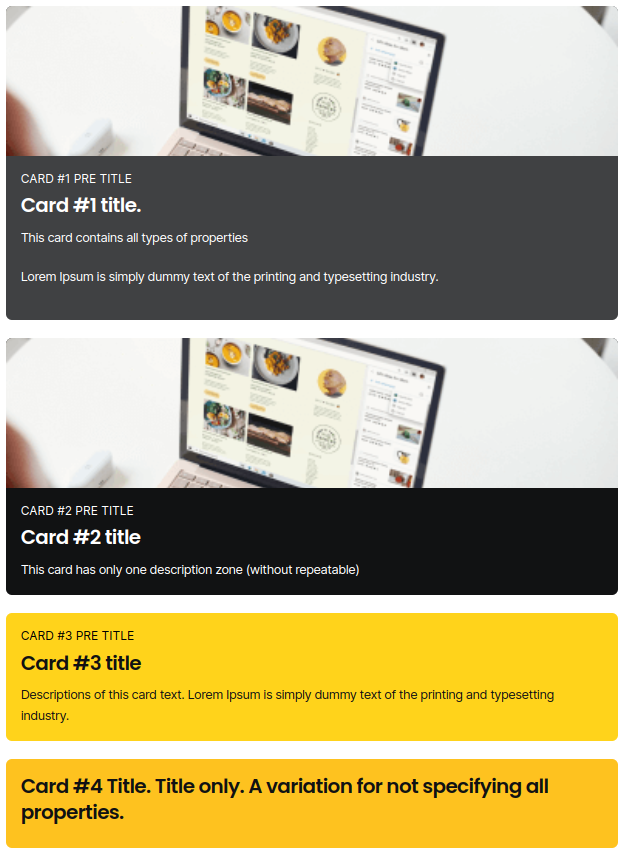

# Colored Cards component

At first, you should import this **Colored Card** to your component.

Please use this import:

```javascript
import ColoredCards from '@/components/Cases/shared/ColoredCards'
```

## Cards object properties

Then you should create a data file (or use existing) and create **cardsDataArray** (you can use your variable name)


Empty card object for example:
```javascript
const cardsDataArray = [
  {
    preTitle: '',
    title: '',
    descriptions: '',
    image: {
      width: 0,
      height: 0,
      folder: '',
      file: '',
      alt: '',
    },
    colors: {
      card: '',
      preTitle: '',
      title: '',
      descriptions: '',
    },
  },
  {
    ...
  }
]
```


Example import data file (for case page)

```javascript
import { cardsDataArray } from '@/data/caseName'
```

Add imported file to component **data**:

```javascript
export default {
  data() {
    return {
      cardsDataArray,
    }
  },
}
```

## Usage
Add component to page

```html
<ColoredCards
  :cards-data="cardsDataArray" 
  grid-type="one-left-two-right"
/>
```

#Component properties

###Colored Cards properties

| Parameter     | Type     | Required | Description                          |
| :------------ | :------- | :------  | :----------------------------------- |
| `:cards-data` | `array`  | **true** | Name of array variable in data file  |
| `grid-type`   | `string` | **true** | Type of card layout                  |

###Available grid-type values
| Parameter              | Description         |
| :--------------------- | :-------------------|
| `one-one`              | Type of card layout |
| `two-one`              | Type of card layout |
| `two-two`              | Type of card layout |
| `one-left-two-right`   | Type of card layout |

###Cards object properties

| Parameter                | Type                 | Required  | Description                                                                                                             |
| :----------------------- | :------------------- | :-------- | :---------------------------------------------------------------------------------------------------------------------- |
| `preTitle`               | `string`             | **false** | Text before card title                                                                                                  |
| `title`                  | `string`             | **false** | Card title                                                                                                              |
| `descriptions`           | `string` or `array`  | **false** | Card description text. If you need two or more description blocks you should use array of strings                       |
| `image`                  | `object`             | **false** | Object with image props                                                                                                 |
| `   image.width`         | `number`             | **false** | Width of image                                                                                                          |
| `   image.height`        | `number`             | **false** | Height of image                                                                                                         |
| `   image.folder`        | `string`             | **true**  | Image folder name on s3 server                                                                                          |
| `   image.file`          | `string`             | **true**  | Image folder name on s3 server                                                                                          |
| `   image.alt`           | `string`             | **true**  | Alternative text to display if the image itself cannot be displayed.                                                    |
| `colors`                 | `object`             | **false** | Object with all card color props. <span style="color:red">Do not use HEX</span>. Only color class name available to use |
| `   colors.card`         | `string`             | **false** | Card background color                                                                                                   |
| `   colors.preTitle:`    | `string`             | **false** | Pre title color                                                                                                         |
| `   colors.title`        | `string`             | **false** | Title text color                                                                                                        |
| `   colors.descriptions` | `string`             | **false** | Descriptions text color                                                                                                 |


##Grid type layout visual examples:

### **one-one**

<hr>

### **two-one**

<hr>

### **two-two**

<hr>

### **one-left-two-right**


## Author
- [Antoneo333](https://github.com/Antoneo-MD)
